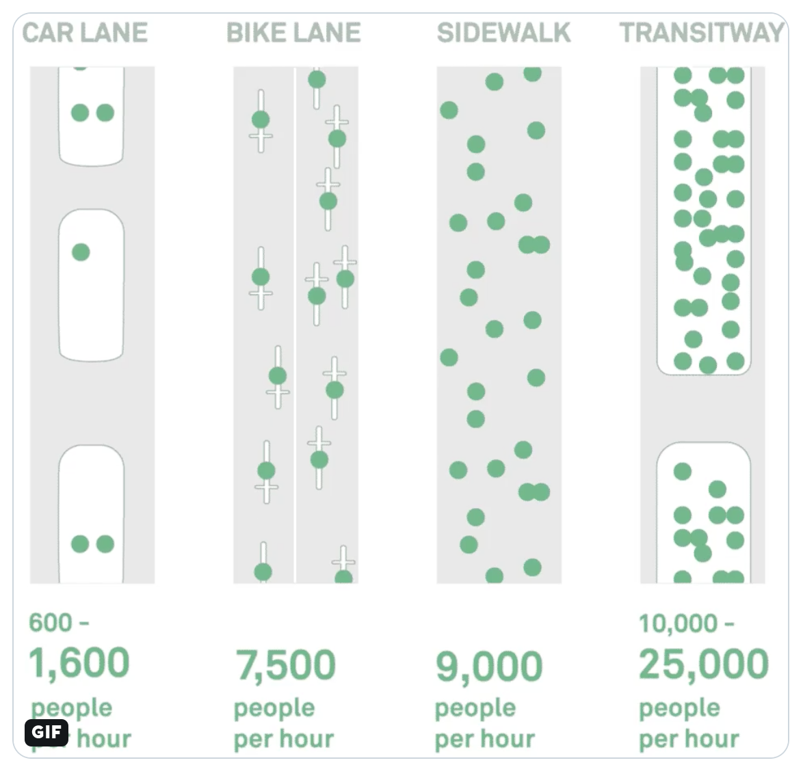

```{r setup, include=FALSE}
options(htmltools.dir.version = FALSE)
```

## Teaching to See 

<a href="http://teachingtosee.org/film/TeachingToSee.html"></a>

---

class: center, middle

> "[...] Not so see an object. But to see it as something round or squared, something textured or smooth. And to translate what they see into a form language."
>
> `r tufte::quote_footer('--- Inge Druckrey')`


---

class: center, middle

> "D3 allows you to bind arbitrary data to a Document Object Model (DOM), and then apply data-driven transformations to the document. For example, you can use D3 to generate an HTML table from an array of numbers. Or, use the same data to create an interactive SVG bar chart with smooth transitions and interaction.

> D3 is not a monolithic framework that seeks to provide every conceivable feature. Instead, D3 solves the crux of the problem: efficient manipulation of documents based on data"
>
> `r tufte::quote_footer('--- Mike Bostock, Introduction to D3')`

---

class: center, middle

## When Do We Use Visualization as Researchers?

---

class: center, middle


---


class: center, middle


---

class: center, middle

<a href="https://twitter.com/BrentToderian/status/1194524987865960448?s=20"></a>

---

## Implementation in R 

1. Base R (plot)
2. Layered [Grammar of Graphics]() (ggplot2)
3. Javascript / SVG libraries (leaflet, plotly, D3,...)

---

## Base R

```{r, fig.height=5}
plot(AirPassengers)
class(AirPassengers)
```


---

## ggplot2 

```{r, warning=FALSE,message=FALSE, fig.height=5}
library(tsbox)
library(dplyr)
library(ggplot2)

ts_data.frame(AirPassengers) %>% 
    ggplot(aes(x = time,
               y = value)) +
    geom_line() +
    theme_bw()

```

---

## dygraphs (web based)

```{r,message=FALSE, fig.width=8, fig.height=4}
library(dygraphs)
dygraph(AirPassengers)


```

---