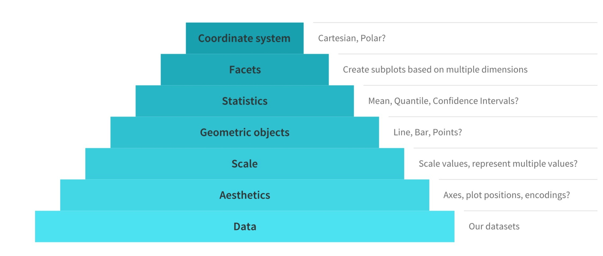
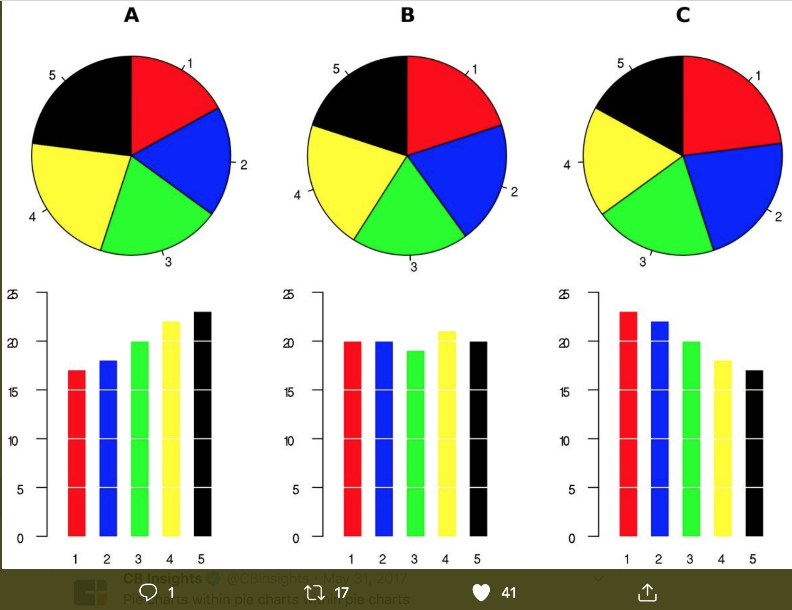

```{r setup, include=FALSE}
options(htmltools.dir.version = FALSE)
```

## Teaching to See 

<a href="http://teachingtosee.org/film/TeachingToSee.html"></a>

---

class: center, middle

> "[...] Not so see an object. But to see it as something round or squared, something textured or smooth. And to translate what they see into a form language."
>
> `r tufte::quote_footer('--- Inge Druckrey')`


---

class: center, middle

> "D3 allows you to bind arbitrary data to a Document Object Model (DOM), and then apply data-driven transformations to the document. For example, you can use D3 to generate an HTML table from an array of numbers. Or, use the same data to create an interactive SVG bar chart with smooth transitions and interaction.

> D3 is not a monolithic framework that seeks to provide every conceivable feature. Instead, D3 solves the crux of the problem: efficient manipulation of documents based on data"
>
> `r tufte::quote_footer('--- Mike Bostock, Introduction to D3')`

---

class: center, middle

## When Do We Use Visualization as Researchers?

---

class: center, middle


---


class: center, middle


---

class: center, middle

<a href="https://twitter.com/BrentToderian/status/1194524987865960448?s=20"></a>

---

## Implementation in R 

1. Base R (plot)
2. Layered [Grammar of Graphics]() (ggplot2)
3. Javascript / SVG libraries (leaflet, plotly, D3,...)

---

## Base R

```{r, fig.height=5}
plot(AirPassengers)
class(AirPassengers)
```


---

## ggplot2 

```{r, warning=FALSE,message=FALSE, fig.height=5}
library(tsbox)
library(dplyr)
library(ggplot2)

ts_data.frame(AirPassengers) %>% 
    ggplot(aes(x = time,
               y = value)) +
    geom_line() +
    theme_bw()

```

---

## dygraphs (web based)

```{r,message=FALSE, fig.width=8, fig.height=4}
library(dygraphs)
dygraph(AirPassengers)


```

---

class: center,middle

## Layered Grammar of Graphics vs baseR

---

## base R 

.pull-left[

```{r,eval=FALSE}
library(datasauRus)
head(datasaurus_dozen_wide)
plot(datasaurus_dozen_wide$dino_x,
     datasaurus_dozen_wide$dino_y)
```
]

.pull-right[

```{r, echo=FALSE, fig.height=4}
library(datasauRus)
head(datasaurus_dozen_wide[,c("dino_x","dino_y","away_x","away_y","star_x","star_y")])
plot(datasaurus_dozen_wide$dino_x,
     datasaurus_dozen_wide$dino_y)

```

]

---

## Layered Grammar of Graphics

.pull-left[

```{r,eval=FALSE}
library(datasauRus)

datasaurus_dozen %>% #<<
    filter(dataset %in% c("dino", #<<
                          "star", #<<
                          "away")) %>% #<<
    ggplot(
       aes(x = x,
           y = y,
           color = dataset)) +
    geom_point() +
    theme_void() +
    theme(legend.position = "none") +
    scale_colour_viridis_d()
```
]

.pull-right[

```{r, echo=FALSE, fig.height=4}

datasaurus_dozen %>% 
    filter(dataset %in% c("dino",
                          "star",
                          "away"))

```

]

---

## Layered Grammar of Graphics

.pull-left[

```{r,eval=FALSE}
library(datasauRus)

datasaurus_dozen %>% 
    filter(dataset %in% c("dino", 
                          "star", 
                          "away")) %>% 
    ggplot( #<<
       aes(x = x, #<<
           y = y, #<<
           color = dataset)) + #<<
    geom_point() + #<<
    theme_void() + #<<
    theme(legend.position = "none") + #<<
    scale_colour_viridis_d() #<<
```
]

.pull-right[

```{r, echo=FALSE, fig.height=4}

datasaurus_dozen %>% 
    filter(dataset %in% c("dino",
                          "star",
                          "away")) %>% ggplot( 
       aes(x = x, 
           y = y, 
           color = dataset)) + 
    geom_point() + 
    theme_void() + 
    theme(legend.position = "none") + 
    scale_colour_viridis_d() 

```

]

---

## Layered Grammar of Graphics



source: [Towards Data Science Blog](https://towardsdatascience.com/a-comprehensive-guide-to-the-grammar-of-graphics-for-effective-visualization-of-multi-dimensional-1f92b4ed4149)

---

## Task 9 Reproduce the datasauRus!

1. install the {datasauRus} package from CRAN
2. explore the two datasets *datasaurus_dozen* and *datasaurus_dozen_wide* using the common functions such as *head*, *tail*, *str*. Which dataset is suitable for use with {ggplot2} ?

3. Create a points plot (using *geom_point*), but limit the dataset to just the dino, the star and the bullseye.

4. Add a new facet layer 

```{r,eval=FALSE}
facet_wrap(~dataset, ncol = 3)`
```

How does the plot change ? Discuss the logic
behind this syntax (see also [{ggplot}'s facet function reference](https://ggplot2.tidyverse.org/reference/facet_wrap.html) .

---

## The Importance of a Visual Concept



---

## The Importance of a Visual Concept


---

## The Importance of a Visual Concept

- [Remove to Improve by Dark Horse Analytics](https://www.darkhorseanalytics.com/blog/salvaging-the-pie)


---

## Challenge: Create a Barplot of the Course's Demographics

1. Figure out a way to survey gender and studies.

2. Record the results in a {dplyr} *tibble*

3. Create a bar chart using {ggplot2}'s *geom_bar()*. 
Make sure to check the [{ggplot2} function reference for geom_bar](https://ggplot2.tidyverse.org/reference/geom_bar.html). Display study counts and test mapping gender to a *facet* or *fill*.

---


## Higher Level Plots: Basic Leaflet Example

.pull-left[
```{r}
loc <- data.table::fread("../data/orte.csv")
head(loc)
```

```{r, echo=TRUE,eval=FALSE}
library(leaflet)
m <- leaflet(data = loc) %>% 
    addTiles() %>% 
    addMarkers(~lng,~lat)
m

```

For more information visit [R for Leaflet](https://rstudio.github.io/leaflet/).
]


.pull-right[
```{r, echo=FALSE,eval=TRUE}
library(leaflet)
m <- leaflet(data = loc) %>% 
    addTiles() %>% 
    addMarkers(~lng,~lat)
m

```

]


---

## Understanding Shapes & Choropleths

.pull-left[

```{r,eval=FALSE}
library(geojsonio)
library(dplyr)
library(leaflet)
fso <- geojson_read("../data/ch_fso_simple.geojson",
                    what = "sp")
leaflet(fso) %>% 
    addTiles() %>% 
    addPolygons()


```

]

]

.pull-right[
```{r, echo=FALSE,message=FALSE}
library(geojsonio)
library(dplyr)
fso <- geojson_read("../data/ch_fso_simple.geojson",
                    what = "sp")
leaflet(fso) %>% 
    addTiles() %>% 
    addPolygons()
```

]


---

## Understanding Shapes & Choropleths


.pull-left[

```{r,eval=FALSE}
library(dplyr)
fso_pop <- tibble(GRNR = 1:7,
       POP = c(1593839,1842251,1128723,
               1466424,1153485,790458,351946))
fso_pop


```

]

source: [FSO Regions](https://www.bfs.admin.ch/bfs/de/home/statistiken/querschnittsthemen/raeumliche-analysen/raeumliche-gliederungen/analyseregionen.html)

]

.pull-right[
```{r,}
library(geojsonio)
library(dplyr)
fso <- geojson_read("../data/ch_fso_simple.geojson",
                    what = "sp")

# also use str() and class to explore the fso object!
head(fso@data)


```

]


---
    
## Understanding Shapes & Choropleths    

.pull-left[

```{r,eval=FALSE}
library(geojsonio)
library(dplyr)
library(leaflet)
fso <- geojson_read("../data/ch_fso_simple.geojson",
                    what = "sp")
fso_pop <- tibble(GRNR = 1:7,
       POP = c(1593839,1842251,1128723,
               1466424,1153485,790458,351946))

fso@data <- merge(fso@data,fso_pop)
pal <- colorNumeric("viridis", NULL)
leaflet(fso) %>%
    addTiles() %>%
    addPolygons(stroke = FALSE,
                smoothFactor = 0.3, fillOpacity = .6,
                fillColor = ~pal(log10(POP)),
    ) %>% 
    addLegend(pal = pal,
              title = "Population",
              values = ~log10(POP), opacity = 1.0,
              labFormat = labelFormat(transform = function(x) round(10^x)))


```

]

]

.pull-right[
```{r, echo=FALSE, message=FALSE}
library(geojsonio)
library(dplyr)
library(leaflet)
fso <- geojson_read("../data/ch_fso_simple.geojson",
                    what = "sp")
fso_pop <- tibble(GRNR = 1:7,
       POP = c(1593839,1842251,1128723,
               1466424,1153485,790458,351946))

fso@data <- merge(fso@data,fso_pop)
pal <- colorNumeric("viridis", NULL)
leaflet(fso) %>%
    addTiles() %>%
    addPolygons(stroke = FALSE,
                smoothFactor = 0.3, fillOpacity = .6,
                fillColor = ~pal(log10(POP)),
    ) %>% 
    addLegend(pal = pal,
              title = "Population",
              values = ~log10(POP), opacity = 1.0,
              labFormat = labelFormat(transform = function(x) round(10^x)))
```

]


---

## Task 10:

1. Download the Swiss FSO regions geojson file from the course github repo.

2. Try to reproduce the FSO region population choropleth.

- [Leaflet for R documentation](https://rstudio.github.io/leaflet/)

- [Switzerland FSO Region geoJSON](https://github.com/mbannert/dh-2019/blob/master/session_5/data/ch_fso_simple.geojson)


---


## Further Reads on Spatial Visualization

- [Robin Lovelace Advanced mapping](https://geocompr.robinlovelace.net/adv-map.html)
- [Opendata Swiss for Shape files](http://opendata.swiss/)
- [Timo Grossenbacher (SRF)](https://timogrossenbacher.ch/2016/12/beautiful-thematic-maps-with-ggplot2-only/)
- [Rob Kabacoff Datavis](https://rkabacoff.github.io/datavis/)


