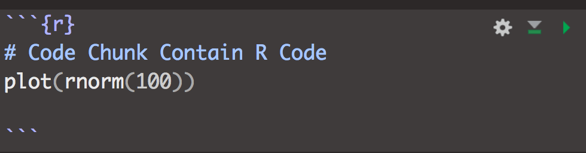

```{r setup, include=FALSE}
options(htmltools.dir.version = FALSE)
```

class: center,middle

### What is Markdown ?

---

class: center,middle

## It's a <font color="#0000FF">mark-up</font> language. 

---

## Just like HTML. 

```
<div class="some-class">Just like HTML.</div>
<bold>be bold</bold> or <it>italic</it>.
<div id="be-right">or position stuff to the right</div>
<div id="be-left">or to the left</div>

```
---


class: center,middle

### What is RMarkdown ?

---

class: center,middle

### RMarkdown = R + Markdown

---

## RMarkdown = R + Markdown

- markdown text: some * formatted text *
    - bold and italic text
    - lists
    - headers (e.g., section titles)
    - hyperlinks
- R Code Chunks



---

## RMarkdown = R + Markdown

```{r, echo=TRUE}
plot(rnorm(100))
```

---

## D-I-Y Example

1. Make sure the {rmarkdown} package is installed and up-to-date. 
2. Create a new RMarkdown file (.Rmd file extension). 


---

## D-I-Y Example: Select HTML


---


## D-I-Y Example: first_markdown.Rmd


---

## Markdown Task

1. Try to create a similar .Rmd file and create an HTML file from it. Take a look at it using your favorite web browser.

2. Try other formats. Make sure the {knitr} package is installed and try to render to other formats such as .pdf or word.


