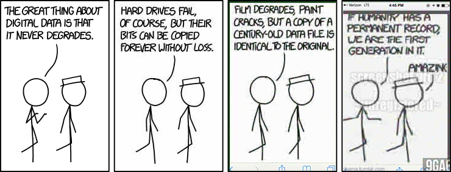

```{r setup, include=FALSE}
options(htmltools.dir.version = FALSE)
```

class: center, middle

## Take Aways from Session I 
## Why Code When You Can Click?

---

class: center, middle

## Reproducibility


---

class: center, middle

## Visualization

<a href="https://informationisbeautiful.net/visualizations/who-old-are-you/"></a>


---

class: center, middle

## Code as a Communication Channel


---

class: center, middle

## Automation & Scaling


<!-- => discussion: Up for debate: Can Inference beyond descriptive stuff.
Can't be answered globally. But calling it failure to be able to automate stuff, is plain clickbaiting. -->

---

class: center, middle

## Or in Other Words ...


---

## Breaking Down Code: General Advice

1. 'Eat Cake First', i.e., run the code see what it does (unless you work in security)
2. Read line by line
3. Read lines from the inside out
4. Understand scoping

---

## Breaking Down Code: A Minimal API Wrapper

1. Go to [github.com/mbannert/dh-2019/....](https://github.com/mbannert/dh-2019/blob/master/demos/01_apis.R) to see what we will be working on
2. Copy & Paste the code from the [raw version](https://raw.githubusercontent.com/mbannert/dh-2019/master/demos/01_apis.R) to a new R file (to create a new file press CMD+Shift+N on a Mac / Ctrl+Shift+N on Win & Linux)

3. Select all the code in the new file and run the selection (Cmd+Enter on a Mac / Ctrl+Enter on Win & Linux)

4. What happens? Do you get errors? Can you make sense of the 
error messages?

Let's understand what we do here and [break down the code](breaking_down_code.html).

---


## Task 1: Write Your Own Wrapper

This is the URL for the METs search endpoint: https://collectionapi.metmuseum.org/public/collection/v1/search?q=

Write an own wrapper function called *search_MET* that

- a search character string as its only argument 
- returns a vector of object ids as results

BONUS: Find / explain what the function should return in case there are no results found. 

---


